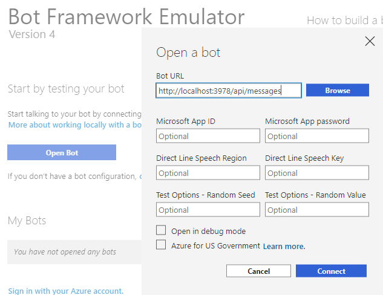
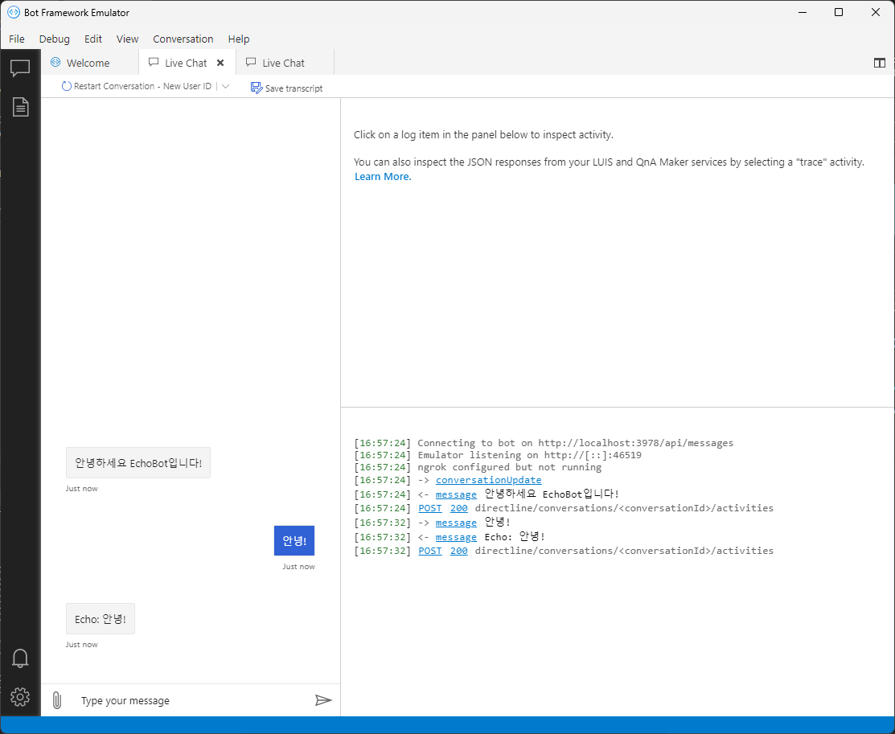

# Echobot

봇프레임워크 v4 에코 봇 예제 입니다.
본 코드는 [02. Echo bot](https://github.com/microsoft/BotBuilder-Samples/tree/main/samples/csharp_dotnetcore/02.echo-bot)를 기반으로 작성되었습니다.]

## 사전 준비 사항

Winget 을 이용하여 필요한 구성요소를 설치 합니다.

- [Winget](https://learn.microsoft.com/ko-kr/windows/package-manager/winget/) 설치
  ```powershell
  $ProgressPreference='Silent'
  Invoke-WebRequest -Uri https://github.com/microsoft/winget-cli/releases/download/v1.3.2691/Microsoft.DesktopAppInstaller_8wekyb3d8bbwe.msixbundle -OutFile .\MicrosoftDesktopAppInstaller_8wekyb3d8bbwe.msixbundle
  Invoke-WebRequest -Uri https://aka.ms/Microsoft.VCLibs.x64.14.00.Desktop.appx -OutFile Microsoft.VCLibs.x64.14.00.Desktop.appx
  Add-AppxPackage Microsoft.VCLibs.x64.14.00.Desktop.appx
  Add-AppxPackage Microsoft.DesktopAppInstaller_8wekyb3d8bbwe.msixbundle
  ```
- [.NET SDK](https://dotnet.microsoft.com/download) 버전 7.0 또는 8.0

  ```powershell
  # 버전 검색
  winget search "Microsoft.DotNet.SDK"

  # .Net 7.0 설치
  winget install "Microsoft.DotNet.SDK.7"
  ```

- [Visual Studio 2022 Community](https://visualstudio.microsoft.com/vs/whatsnew/) 설치
  ```powershell
  winget install "Microsoft.VisualStudio.2022.Community"
  ```

- [Bot Framework Emulator](https://github.com/Microsoft/BotFramework-Emulator/releases/tag/v4.14.1) 설치
  ```powershell
  winget install "Microsoft.BotFrameworkEmulator"
  ```

## 코드 복사 후 실행

- 터미널에서 git clone 을 한 이후 탐색기를 이용해서 솔루션 파일을 오픈합니다.

    ```bash
    # 코드 복사 후
    git clone https://github.com/MSKoreaBotSupportTeam/BotFramework-Samples.git

    # 폴더 이동 후 Examples.sln 파일 열기
    cd ./BotFramework-Samples/ko/csharp_dotnet
    ```

- Visual Studio 에서 Echobot 을 마우스 우클릭 하여 `시작프로젝트로 설정` 한 이후 F5 키를 눌러 실행합니다.
- Bot Emulator 를 실행하고 `Bot URL`에 `http://localhost:3978/api/messages`를 입력 후 `Connect` 버튼을 클릭 합니다.
  
- 다음처럼 Bot Emulator에서 접속하여 테스트 할 수 있습니다.
  
