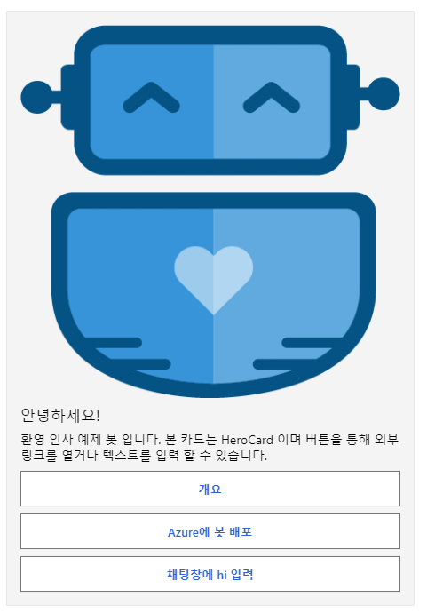

# Welcome Users
사용자가 봇에 처음으로 접속했을 때, 봇이 사용자에게 인사를 해주는 기능입니다.
본 예제는 [Welcome-user](https://github.com/microsoft/BotBuilder-Samples/tree/main/samples/csharp_dotnetcore/03.welcome-user) 소스를 기반으로 합니다.

채널(Teams, Slack, 카카오톡 등)마다 발생되는 이벤트가 다를 수 있으므로 해당채널에서 ConversationUpdate 처리 하는 방법을 숙지 해야 합니다.

봇이 메시지를 보내는 방식은 다음과 같습니다.
- 처음 접속시 인사 메시지
- 사용자가 처음 메시지를 보낼때 응답 메시지
- 사용자 정의 HeroCard 메시지

