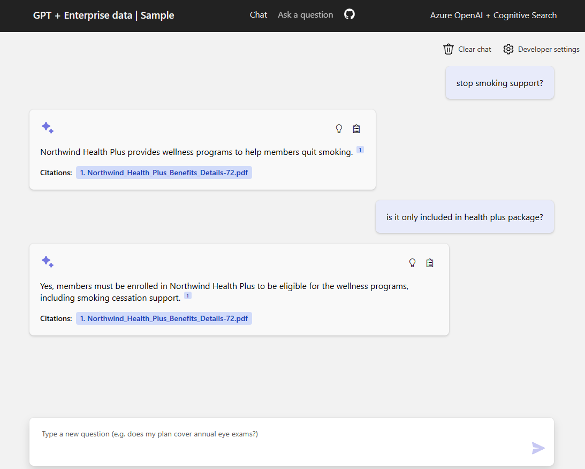
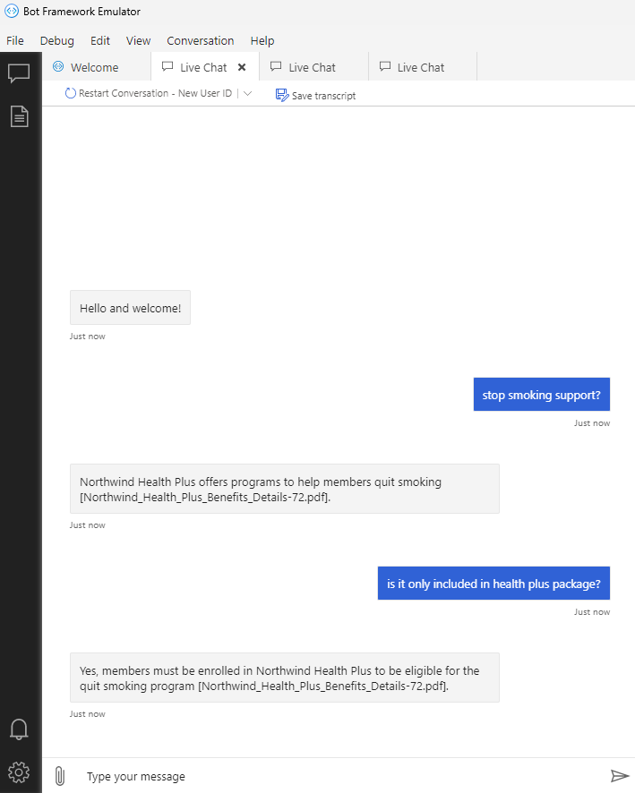
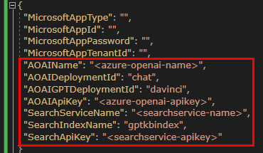
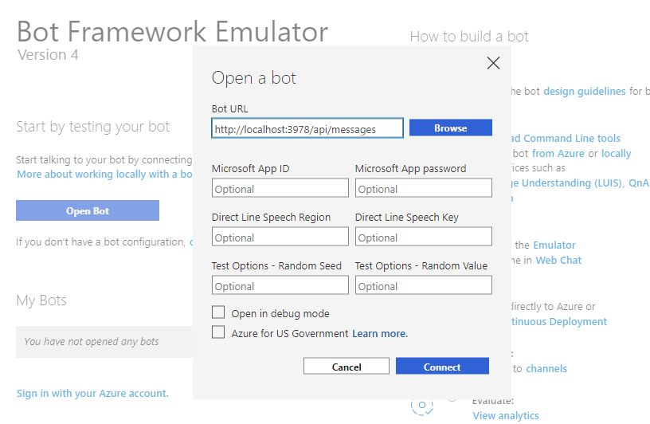

# AzureOpenAIBot

본 예제는 [ChatGPT + Enterprise data with Azure OpenAI and Cognitive Search](https://github.com/Azure-Samples/azure-search-openai-demo) 의 예제를 그대로 이용하여 백엔드의 python 코드를 봇 로직에 C# 코드로 재작성된 프로젝트 입니다. **/chat 부분만**

Retrieval Augmented Generation(RAG) 패턴을 사용하여 Azure OpenAI 를 Bot Framework 에서 Azure Search Service 와 연동하여 최적의 Prompt Completion 을 만드는 내용입니다.

## 사전 준비 사항

- [ChatGPT + Enterprise data with Azure OpenAI and Cognitive Search](https://github.com/Azure-Samples/azure-search-openai-demo#prerequisites)  을 구성하여 OpenAI 서비스와 Search Service 가 생성 되어야 합니다.
 

## 예제 실행 하기

- 환경이 준비되고난 후 프로젝트의 appsettings.json 파일에 다음 내용을 생성된 Azure Resource 에 맞게 변경 합니다. 

- Bot 의 엔드포인트에 접속하기 위해서 Bot Emulator 를 이용해서 Bot Url에  `http://localhost:3978/api/messages` 입력 후 `connect` 를 클릭해 연결 합니다.
  

## 참고
- 참조 패키지는 다음 두가지의 beta 버전을 사용합니다.
  - Azure.AI.OpenAI 1.0.0-beta.5
  - Azure.Search.Documents 11.5.0-beta.2